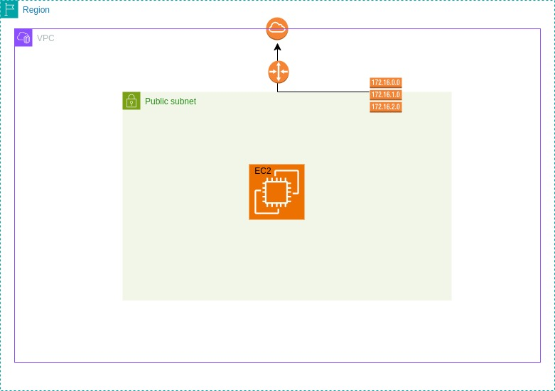

## Terraform project
#### This project utilizes terraform to set up a server from bare metal
#### it created 10 resources in total in AWS cloud
#### variable files such as [variables.tf](./variables.tf) and [terraform.tfvars](./terraform.tfvars) were used to make the script dynamic
#### The Public IP of the web server (EC2 instance) and it's instance-id is made available using [outputs.tf](./outputs.tf) for easy access

**Resources Created**
1. VPC
2. A subnet
3. An internet gateway
4. A route table that was attached to the subnet
5. Route to the internet gateway
6. A security group for the EC2 instance which allow ssh and http access only
7. An EC2 instance with user data scripts to install, enable and start nginx server with [custom html](./test.html) loaded

**Architecture Diagram**

